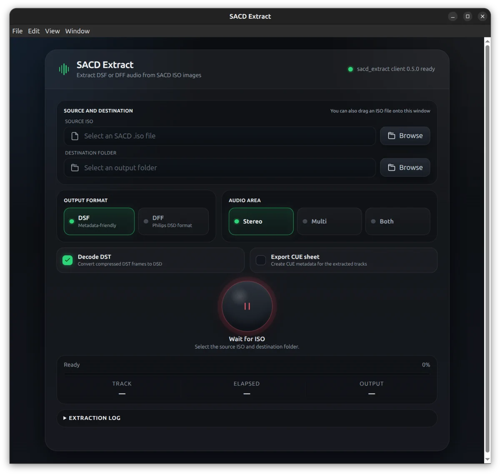

# sacd_extract

Project repository: [github.com/dev-zetta/sacd_extract2](https://github.com/dev-zetta/sacd_extract2)

`sacd_extract` is a command-line tool for inspecting readable SACD images and
extracting their audio and metadata on Linux and Windows. It can write stereo or
multichannel tracks as DSF or DSDIFF, decode DST during extraction, export an
Edit Master file, and generate CUE/XML metadata.

An adopted Electron desktop interface is included under [`gui/`](gui/README.md).
Tagged releases provide ready-to-run GUI packages containing the matching
extractor executable for Linux and Windows.

This repository contains the host-native extractor. It does not authenticate
or decrypt physical SACD media, so local input must already be available as a
readable SACD ISO image. A compatible network source can also be supplied as
`host:port`.

## Features

- Stereo and multichannel extraction
- DSF, DSDIFF, DSDIFF Edit Master, and raw ISO output
- DST-to-DSD conversion
- Per-track selection and consecutive-track concatenation
- CUE and XML metadata export
- Bounded recovery from damaged sectors and malformed DSD/DST frames
- Timestamped per-session extraction logs with severity and subsystem fields
- Configurable ID3v2.3 and ID3v2.4 tagging
- Optional output directories, performer naming, pause handling, and DSF
  padding control
- Cross-platform desktop GUI for the most common extraction settings

## Desktop GUI

The GUI selects a local SACD ISO and destination directory, then drives this
extractor with its current position-independent long options. It supports DSF
or DSDIFF output, stereo, multichannel, or both areas, optional DST decoding,
and CUE export.



Release GUI archives are self-contained: the Actions workflow builds the CLI
first and embeds that tested host-platform executable in the Electron package.

Set `SACD_EXTRACT_PATH=/absolute/path/to/sacd_extract` if the executable is not
under `build/linux`, `build/windows`, the legacy build directories, the GUI
directory, or `PATH`. See
the [GUI documentation](gui/README.md) for packaging details and retained
upstream provenance.

## Build and test

Linux and Windows use the same dependency-checking build entry point:

```bash
scripts/build.sh
```

See the [building guide](docs/building.md) for platform dependencies, build
options, and packaging. See the [testing guide](docs/testing.md) for CTest, GUI,
sanitizer, optional SACD ISO integration, and CI details.

## Usage

Print disc and track metadata without extracting audio:

```bash
sacd_extract "Album.iso" --info
```

Extract all stereo tracks as DSF:

```bash
sacd_extract --stereo --dsf "Album.iso"
```

Extract all multichannel tracks as DSF:

```bash
sacd_extract "Album.iso" --dsf --multichannel
```

Extract selected stereo tracks and convert DST to DSDIFF:

```bash
sacd_extract --tracks 1,5,13 "Album.iso" --stereo --dsdiff --convert-dst
```

Options and the positional input may appear in any order, including when the
`POSIXLY_CORRECT` environment variable is set. The explicit `-i INPUT` and
`--input INPUT` forms remain supported.

Use `-y DIR` to choose the DSF/DSDIFF output directory and `-o DIR` for raw
ISO or DSDIFF Edit Master output.

### Common options

| Option | Purpose |
| --- | --- |
| `-2`, `--stereo` | Select the two-channel area (default) |
| `-m`, `--multichannel` | Select the multichannel area |
| `-s`, `--dsf` | Write individual DSF tracks |
| `-p`, `--dsdiff` | Write individual DSDIFF tracks |
| `-e`, `--edit-master` | Write a DSDIFF Edit Master |
| `-I`, `--iso` | Write a raw ISO |
| `-c`, `--convert-dst` | Convert DST-compressed audio to DSD |
| `-t LIST`, `--tracks LIST` | Extract selected tracks, such as `1,5,13` |
| `-k`, `--concatenate` | Concatenate consecutive selected tracks |
| `-C`, `--cue` | Export CUE and XML metadata |
| `-P`, `--info` | Print disc information without extracting |
| `-i INPUT`, `--input INPUT` | Read an ISO, device, or compatible `host:port` source |
| `--max-read-errors N` | Allow at most `N` permanent media defects per output track; default `10`, `0` is fail-fast |
| `--log` / `--no-log` | Explicitly enable or disable session logging |
| `--log-file FILE` | Write the session log to an explicit path |
| `--log-level LEVEL` | Select `error`, `warning`, `notice`, `info`, or `debug` |

Run `sacd_extract --help` for the complete option list.

For individual DSF or DSDIFF extraction, each generated CUE `FILE` entry names
the corresponding track file and uses file-relative indices. Edit Master output
retains the traditional single-file, disc-relative CUE layout. The `WAVE` token
is retained as the widely supported CUE audio-file convention; strict CDRWIN
CUE syntax does not define native DSF or DSDIFF file types.

## Configuration

An optional `sacd_extract.cfg` in the current working directory can set
defaults. Command-line naming and pause options are overridden when their
matching config entries are present.

```ini
artist=0
performer=0
pauses=0
nopad=0
concatenate=0
id3tag=4
# logging=0
max_read_errors=10
log_level=info
# log_file=/path/to/session.log
```

`id3tag` accepts `0` (disabled), `1` or `2` (ID3v2.3 UTF-16, full or minimal),
`3` (ID3v2.3 ISO-8859-1), and `4` or `5` (ID3v2.4 UTF-8, full or minimal).
Boolean settings accept `0`/`1` or `no`/`yes`.
Omit `logging` to use automatic logging for extraction and export commands;
set it explicitly to override that default.
Command-line logging and error-limit options take precedence over their config
counterparts.

## Damage recovery and logs

Extraction and metadata-export commands automatically create one session log
named `sacd_extract-YYYYMMDD-HHMMSS.log` in the album output directory. Logs
contain local ISO-8601 timestamps, severity, subsystem, selected format/area,
retry details, per-track results, and a final summary. Metadata-only (`-P`),
help, and version commands log only when `--log` or `--log-file` is supplied.

If a batch read is short or fails, the extractor narrows the failure to
individual 2048-byte sectors and retries each sector twice. Unreadable audio
sectors reset the incomplete DSD/DST frame and extraction resumes at the next
valid sector. Raw ISO output writes a zero-filled sector instead, preserving
all subsequent LSN offsets. Malformed sectors, independently incomplete or
nonconsecutive frames, and DST decode failures share the per-track error
budget.

Outputs are first written as `*.inprogress.ext` and atomically published when
the container has been finalized:

- `Track.dsf` — clean output;
- `Track.partial.dsf` — finalized output containing skipped media;
- `Track.failed.dsf` — an output that could not be written or finalized.

The master TOC remains mandatory. Stereo and multichannel areas independently
fall back to their backup TOC and are omitted if neither copy is usable.

Exit statuses are `0` for clean output, `1` for completed partial/abandoned
tracks, `2` for invalid input or another fatal failure, and `130` when the user
interrupts extraction.

## Output integrity

Extracted files should be decoded or checksummed before the source image is
discarded. The investigation and fix for the former intermittent 1 MiB DSF
corruption issue is documented in
[`docs/dsf-output-corruption-investigation.md`](docs/dsf-output-corruption-investigation.md).

## License

This project is distributed under the GNU General Public License version 2.
See [`COPYING`](COPYING).

The adopted GUI is distributed under the MIT license; see
[`gui/LICENSE`](gui/LICENSE) and [`gui/UPSTREAM.md`](gui/UPSTREAM.md).

## Authors

SACD Ripper was created and maintained by its respective upstream authors.
Gabriel Max `<dev@zetta.app>` is a co-author of the host-native desktop
extractor work (2026).
